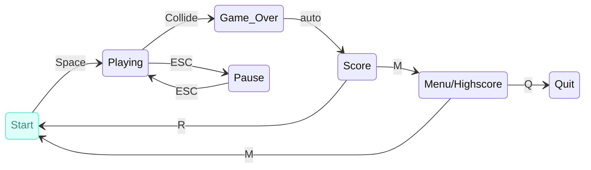

# 🐤 PipeDown — A Flappy Bird Clone in Java (Swing)

A fun, lightweight recreation of the classic **Flappy Bird** — built from scratch in Java using Swing, with progressive difficulty, persistent high scores, and live-synthesized MIDI sound effects (no audio files needed!).
<p align="center">
  
  
  
  <a href="https://github.com/Kala-Koirala/PipeDown/stargazers"></a>
  <a href="https://github.com/Kala-Koirala/PipeDown/commits/main"></a>
</p>


---

## ✨ Features

- 🎯 **Classic Gameplay** — Flap through gaps, avoid the pipes, chase a high score
- 👤 **Player Profiles** — Enter your name at launch; scores are tracked per player
- 🏆 **Persistent High Scores** — Personal bests and the all-time leaderboard are saved to disk and reloaded next time you play
- 📈 **Progressive Difficulty** — Pipe speed increases, gaps narrow, and spawn rate quickens the further you get, so the game keeps getting harder
- 🔊 **Live Synthesized Sound** — Jump, score, level-up, high-score, and game-over sounds are generated in real time through the Java MIDI synthesizer — zero external audio files
- ⚡ **Quick Restart** — Jump straight back in after a Game Over
- ⌨️ **One-Button Controls** — Just the space bar to play, jump, and restart

---

## 🎮 Controls

| Key | Action |
|---|---|
| `SPACE` | Start the game / Flap / Restart after Game Over |
| `M` | Menu |
| `Q` | Quit |
| `P` | Pause / Resume |


---

## 🛠 Tech Stack

| Layer | Technology |
|---|---|
| Language | Java |
| GUI | Java Swing (`JPanel`, `JFrame`, `Timer`) |
| Sound | `javax.sound.midi` (synthesized in real time — no `.wav`/`.mp3` files) |
| Data persistence | Plain text files (`highscore.txt`, `player_name.txt`) |

---

## 📂 Project Structure

```
PipeDown/
├── Main.java                       # Entry point — creates the window and shows the name prompt
├── FlappyBird.java                 # Core game panel — game loop, drawing, input handling
├── Bird.java                       # Bird sprite/position data
├── Pipe.java                       # Base pipe class
├── TopPipe.java / BottomPipe.java  # Pipe variants
├── DifficultyManager.java          # Calculates speed, gap size, and spawn rate from score
├── HighScoreManager.java           # Loads/saves player names and high scores
├── ThemeManager.java               # Stores the different themes taht can be toggled
├── SoundManager.java               # Generates all sound effects via MIDI
├── UsernameDialog.java              # Popup for entering the player's name
└── assets/                          # Sprites and backgrounds

```

## 🐦 Project Preview

 <p>Figure 1: Welcome Screen</p>

 <p>Figure 2: Game Over Screen </p>

 <p>Figure 3: Paused Screen </p>


---


## 📼 The FSM Diagram




---

## 🚀 Getting Started

**Requirements:** a Java Development Kit (JDK) installed, so both `javac` and `java` are available on your PATH.

```bash
# 1. Navigate into the project folder
cd PipeDown
 
# 2. Compile and run in one line
javac Main.java && java Main
```
On first launch, you'll be asked to enter a player name — your scores are saved and tracked against that name for future sessions.

---

## 🙌 Contributors
 
Thanks to everyone who's worked on this project:
 
- **Purnima Koirala** - [@Kala-Koirala](https://github.com/Kala-Koirala)
- **Shahisha Adhikari** - [@Shahisha1](https://github.com/Shahisha1)
- **Shreya Dhakal** [@Shreyaoff](https://github.com/shreyaoff)
- **Kabir Lama** - [@kabirlama28-web](https://github.com/kabirlama28-web)

Want to contribute too? Fork the [repo](https://github.com/Kala-Koirala/PipeDown), make your changes, and open a pull request against `main`.

